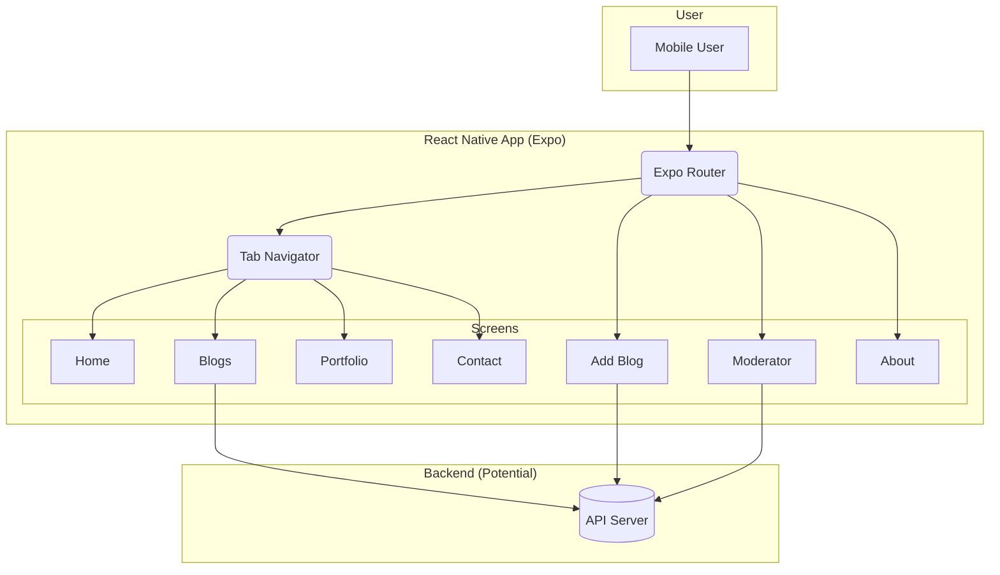

# Personal Portfolio & Blog Platform

## Project Aim
This project is a mobile application designed as a personal portfolio and blogging platform. It provides a structured way to showcase personal work and publish articles, with separate functionalities for content creation and moderation.

## Technical Implementation
Built with React Native and the Expo framework, this application uses a modern, file-based routing system powered by Expo Router. The architecture includes tab-based navigation for a clear user experience. Core functionality relies on React for UI management, and it is structured to potentially connect to a backend for dynamic content, as suggested by the inclusion of `axios` for API requests. The project is written in TypeScript, ensuring type safety and improved code quality.

## Key Features
- **Content Management:** Includes screens for adding and viewing blog posts, forming a simple CMS.
- **Structured Navigation:** Features a tabbed layout for easy access to Home, Blogs, Portfolio, and other key sections.
- **Role-Based Views:** Implies different user roles with the inclusion of a dedicated `moderator` screen.

## Setup Instructions

- **Install dependencies:** `npm install`

- **Run the app:** `npx expo start`

## System Diagram

